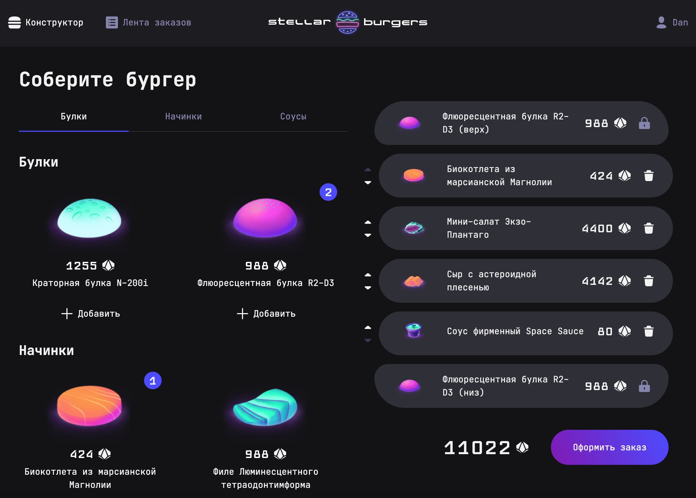
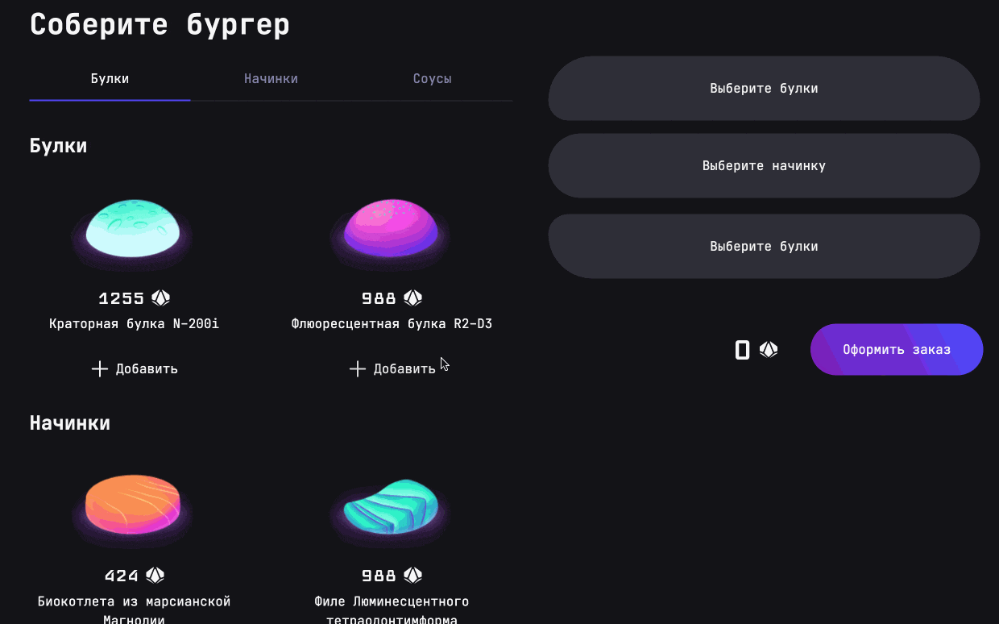
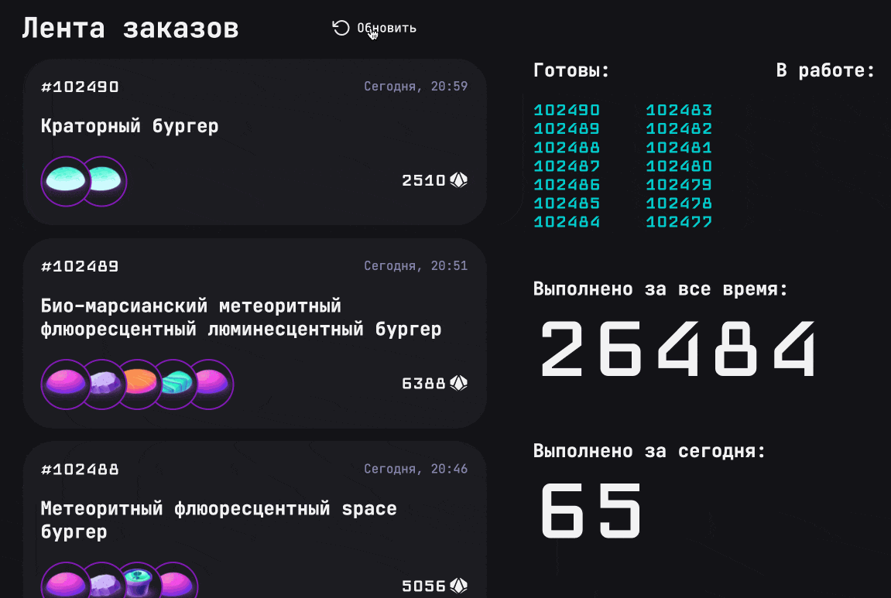
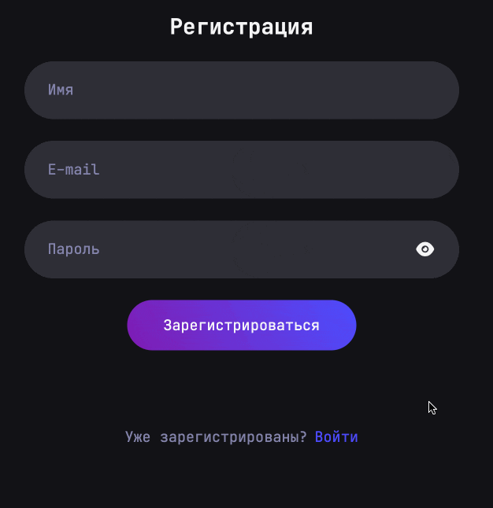
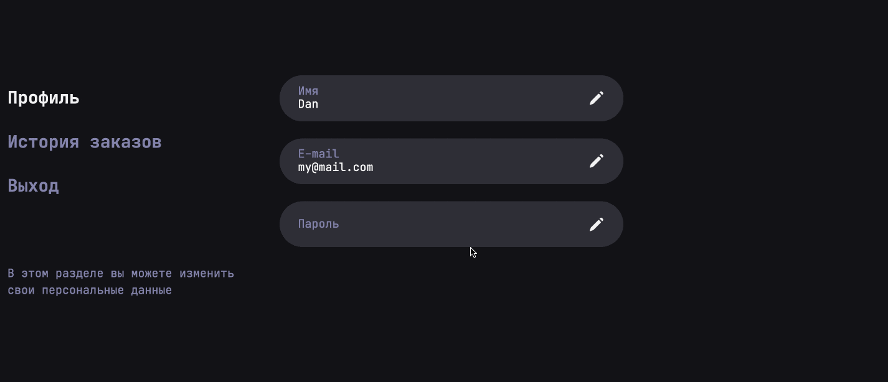

# Stellar Burgers — сайт космической бургерной

Stellar Burgers — это учебный проект, созданный в рамках курса «Фронтенд-разработчик» от «Яндекс Практикума». Здесь пользователи могут собирать бургеры в конструкторе ингредиентов, оформлять заказ и следить за лентой заказов.

 

 
 

 ## Технологии

  

## Особенности

- Возможность собирать собственные бургеры в конструкторе ингредиентов

 

 
 

 - Просмотр общей ленты заказов

 

 
 

 - Регистрация, авторизация и восстановление забытого пароля

 

 
 

  - Личный кабинет, в котором можно изменять данные профиля и просматривать свои заказы

 

 
 

 ## Запуск

- Установка зависимостей: `npm install`

- Запуск dev-сервера: `npm run start`

- Юнит-тесты с помощью Jest: `npm run test`

- E2E-тесты с помощью Cypress: `npm run cypress:open`

## Задачи

В рамках этого проекта я выполнил следующие задачи.

- Настроил работу с состояниями с помощью Redux Toolkit. Для этого были созданы слайсы ингредиентов, конструктора бургеров, ленты заказов, заказа и пользователя. Для взаимодействия с API были прописаны соответствующие асинхронные Thunk-функции. За логгирование ошибок отвечает специальное middleware.

- Реализовал механизм регистрации и авторизации с сохранением токенов в куки и Local Storage.

- Настроил маршрутизацию с помощью React Router DOM, в том числе защищенные маршруты с проверкой авторизации пользователя.

- Написал интеграционные тесты с помощью Cypress и создал соответствующие моковые данные.

- Написал юнит-тесты для редьюсеров хранилища с помощью Jest
